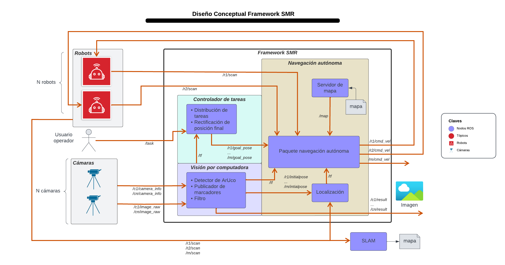
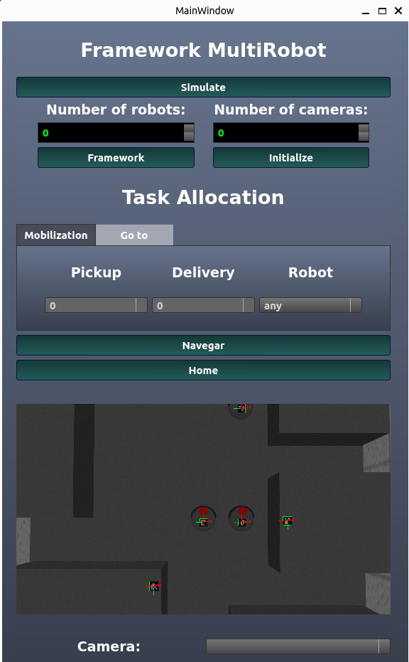

# MultiRobot System Framework
[](https://nodesource.com/products/nsolid)

## Introduction
MRS Framework is a is a comprehensive platform (built by Anthonny Piguave and Diego Ronquillo) designed to facilitate the development and deployment of multirobot systems, providing a set of essential modules and tools to enable various capabilities. The framework consists of the following core components:
- Autonomous navigation module for N robots.
- Computer vision module for aruco markers detection to provide localization and rectification.
- Task manager module for distributing pick-up/delivery tasks, go to pose tasks and go to home task.
- 3 simulation environments equiped with robotic models such as Turtlebot3 and Create3 for testing.
- Graphical User Interface (GUI).

The MRS Framework is designed to be versatile, enabling researchers and developers to experiment with different robot types, test various algorithms, and build complex multirobot systems that can handle diverse tasks in real-world scenarios. By providing these core modules and simulation environments, the MRS Framework accelerates the development and deployment of multirobot applications while fostering collaboration and innovation in the field of robotics.
## Framework Overview
An overview of the framework modules and communications is presented below:

## Installation
1.- Clone the github repository in a workspace source folder. (ws/src)
```sh
git clone https://github.com/
```
2.- Install dependencies
```sh
rosdep install -y --from-paths src --ignore-src
```
3.- Go to workspace directory and build the pacakge.
```sh
Colcon build
```
## Usage
0.- Navigate to the workspace directory (Previous step to perform in all new cmd window opened)
```sh
source install/setup.bash
```
1.- Launch the simulation. (In case you are working with a real system, you can skip this step)
```sh
ros2 launch ramel ramel_mrs_simulation.launch
```
2.- Open a new cmd window and launch the MRS.
```sh
ros2 launch ramel MRS.launch n:=3
```
Where n is the number of robots of the system, by default 3.
3.- Open a new cmd window and set the initial pose of the robots.
```sh
python3 src/MultiRobot/ramel/scripts initial_pose_publisher.py n
```
Be sure to replace "n" with the number of robots. For example, in the case of 3 robots:
```sh
python3 src/MultiRobot/ramel/scripts initial_pose_publisher.py 3
```
4.- Launch the task manager.
Markdown is a lightweight markup language based on the formatting conventions
```sh
python3 src/MultiRobot/ramel/scripts mrs_manager.py n
```

Now you can send task commands to the robots with this format:
> `Params for navigation: <id_task> <arg1> <arg2> <id_robot>(optional).`

Where id_task is 1 for pick-up/delivery tasks and 2 for go to pose task.
For instance, if I want the nearest robot to pick-up a box in station 1 and leave it in station 3, the command would be:
```sh
1 1 3
```
## Graphical User Interface
For installing the GUI desktop aplication follow this setps.
0.- Navigate to workspace directory.
1.- Navigate to ramel directory.
```sh
cd src/MultiRobot/ramel
```
2.- Move the GUI application to Desktop
```sh
mv framework.desktop ~/Desktop/
```
Now you are able to open the GUI from Desktop.

