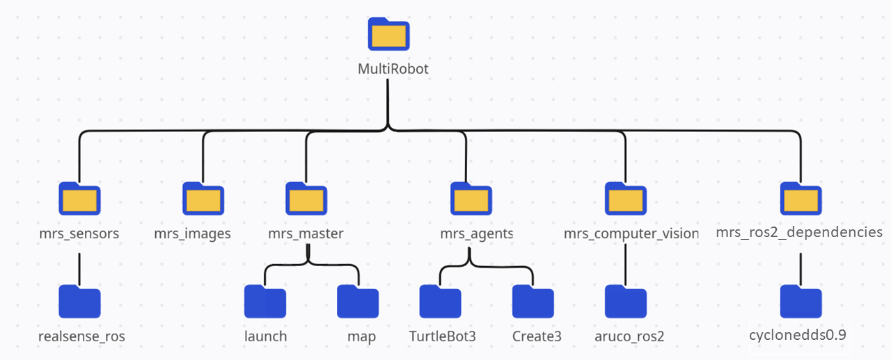

# MultiRobot System Framework
[](https://nodesource.com/products/nsolid)

## Introduction
MRS Framework is a is a comprehensive platform (built by Anthonny Piguave and Diego Ronquillo) designed to facilitate the development and deployment of multirobot systems, providing a set of essential modules and tools to enable various capabilities. The framework consists of the following core components:
- Autonomous navigation module for N robots.
- Computer vision module for aruco markers detection to provide localization and rectification.
- Task manager module for distributing pick-up/delivery tasks, go to pose tasks and go to home task.
- 3 simulation environments equiped with robotic models such as Turtlebot3 and Create3 for testing.
- Graphical User Interface (GUI).

The MRS Framework is designed to be versatile, enabling researchers and developers to experiment with different robot types, test various algorithms, and build complex multirobot systems that can handle diverse tasks in real-world scenarios. By providing these core modules and simulation environments, the MRS Framework accelerates the development and deployment of multirobot applications while fostering collaboration and innovation in the field of robotics.
## Framework Overview
An overview of the framework modules and communications is presented below:


## Requirements:

- Operating System: Ubuntu Linux Jammy Jellyfish (22.04)
- Consider according to the number of robots the computational requirements of the framework.

## Dependencies:

- ROS2 Humble. Installation: https://docs.ros.org/en/humble/Installation/Ubuntu-Install-Debians.html
- Verify gazebo installation
- Verify the acquisition of the gazebo controls library. If it is not installed:
```sh
sudo apt-get install ros-humble-gazebo-ros2-control
```

## Installation
1.- Clone the github repository in a workspace source folder. (ws_name/src)
```sh
git clone https://github.com/RAMEL-ESPOL/MultiRobot.git
```
2.- Go to workspace directory and Install dependencies
```sh
cd ..
rosdep install -y --from-paths src --ignore-src
```
3.- Build the pacakge.
```sh
colcon build
```
## Usage
0.- Navigate to the workspace directory (The previous step to perform in all new cmd windows opened)
```sh
source install/setup.bash
```
1.- Launch the simulation. (In case you are working with a real system, you can skip this step)
```sh
ros2 launch mrs_master mrs_simulation.launch.py 
```
2.- Open a new cmd window, source in the ws and launch the MRS.
```sh
ros2 launch mrs_master MRS.launch.py n_robots:=3 n_cams:=3
```
Where n_robots and n_cams are the numbers of robots and cameras of the system, by default 3 in both.
3.- Open a new cmd window, source in the ws and set the initial pose of the robots.
```sh
python3 src/MultiRobot/mrs_master/scripts/initial_pose_publisher.py n_robots
```
Be sure to replace "n_robots" with the number of robots. For example, in the case of 3 robots:
```sh
python3 src/MultiRobot/mrs_master/scripts/initial_pose_publisher.py 3
```
4.- Launch the task manager.
Markdown is a lightweight markup language based on the formatting conventions
```sh
python3 src/MultiRobot/mrs_master/scripts/mrs_manager.py n_robots
```

Now you can send task commands to the robots with this format:
> `Params for navigation: <id_task> <arg1> <arg2> <id_robot>(optional).`

Where id_task is 1 for pick-up/delivery tasks and 2 for go to pose task.
If the id_tak is 1, arg1 and arg2 are the id of the workstations, else if id_task if 2, these are the x and y coordinates.
id_robot is the number of the robot in its namespace, for example 1 for r1 robot, if no robot is specified, the manager
will choose the nearest and unoccupied robot.
For instance, if we want the nearest robot to pick-up a box in station 1 and leave it in station 3, the command would be:
```sh
1 1 3
```
## Graphical User Interface
For installing the GUI desktop aplication follow this setps.

0.- Navigate to workspace directory.

1.- Navigate to MultiRobot/mrs_master/scripts directory.
```sh
cd src/MultiRobot/mrs_master/scripts
```
2.- Open framework.desktop and modify paths
> Exec=/path_to_ws/src/MultiRobot/mrs_master/scripts/framework.sh


> Icon=/path_to_ws/src/MultiRobot/mrs_images/icon.png

3.- Move the GUI application to Desktop
```sh
mv framework.desktop ~/Desktop/
```
4.- Right click the icon and choose "Allow launching"

Now you are able to open the GUI from Desktop.

  

## Package Structure
The package structure is the following:
- mrs_agents includes the robots' packages
- mrs_computer_vision includes the aruco libraries
- mrs_images
- mrs_master contains the framework and task master
- mrs_sensors contains cameras' and other sensors' packages
- mrs_ros2_dependencies contains cyclonedds configuration

